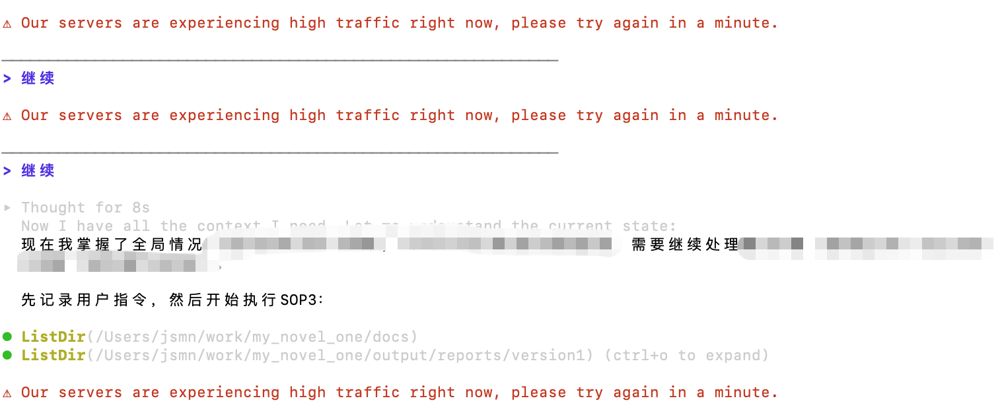

# 一天干完一百万字，谷歌 agy 这个工具简直是头不要命的洪水猛兽

昨天我还在群里吐槽 Antigravity 2.0 更新后像个洪水猛兽，今天就有了极其切肤的痛感与爽感。

大概 agy，没错，就是那个经常被大家戏称为 gay 的命令行工具，它今天帮我干完了一百万字的工作量。一百万字是什么概念？这在以前，可能需要我起早贪黑、孜孜不倦地处理整整一年。

而现在，它只用了几个小时。

打个比方，以前处理这些数据，就像是在没有火车的年代，我蹬着破自行车从北京一路骑到上海，起步就是两周。现在？换上了高铁，两小时嗖的一下就到了。

很多人可能会懵，它到底是怎么做到的？

核心秘密就在于它新增的两个神级指令：goal 和 grill-me。

这两个词第一眼看着有点奇怪，但你绝对不能只从字面意思去理解。

先说 goal。这个指令的本质就是授权和放权。你敲下这个指令，就相当于给 AI 签了一份军令状：

> 不要停，也不要来烦我，你自己决定一切，你被赋予了系统的所有权限，给我死磕到底，直到把手头这个任务完成为止。

指令一发，agy 就开始像个没有感情的赛博黑工一样疯狂干活。它最后只有两种结局：要么把活干完，要么把账号额度耗光。

今天的结果是，它把我的额度干光了。

但我马上发现了它另外极其变态的一点。我迅速切换了另一个账号，让它接着干，它居然能完美续上之前的进度。这种无缝接力干活的体验，直接把我的工作流拉满。当然，到了下午，第二个账号的额度也毫无悬念地被它榨干了。

这让我开始琢磨，稍后必须得研究一下怎么在一台电脑上同时跑多个 agy 账号并发执行。

看着它在那疯狂跑数据，我突然有一种强烈的恍惚感。现在的本地电脑性能，真的还重要吗？因为所有极其沉重的计算任务，本质上全都在云端服务器上完成了。我面前的这台 macbook 设备，其实不过就是一个输入字符的界面而已。

说到这里，我甚至有点佩服库克了。苹果今天推出了那么多款颜色花哨的 MacBook Air，以前觉得那是纯纯的文科生码字机，现在懂了，只要有 agy 这种工具，工程师拿它照样能单挑百万级的工程，因为本地算力已经被彻底边缘化了。

再来说说另一个核心指令 grill-me。

既然 goal 已经能全局执行了，还要 grill-me 干什么？

这也是我今天跑了一百万字才摸透的最佳实践。面对同样的任务，同样的一段提示语，你可以用 goal，也可以用 grill-me。

但在执行大规模批量任务，比如几百上千个文件的处理时，直接上 goal 可能会因为某个意想不到的边界条件导致全面翻车。这时候，你需要在 grill-me 后面加一句话：先不要执行，先跟我讨论。

grill-me 就是用来打样的。它会在执行前提前去趟雷，发现潜在问题，然后主动跑来向你提问：老板，遇到这种特殊情况怎么处理？

你给出决定，它学习并记住。下一次遇到同类问题，它就不会再像个傻子一样重复问你。

当你把所有雷区都排完，把 grill-me 停下，果断换成 goal 的那一刻，AI 就彻底排除了所有的不确定性。它不再有任何疑问，只会极其高效、冰冷地一直跑下去，直到进度条拉满。

所以，grill-me 是为了扫清障碍打样的，而 goal 是为了最终的无脑冲锋。这两个指令的配合，才是实现真正意义上任务自动化的基石。

在今天这百万字的狂飙里，agy 没因为系统故障停过一次，也没因为网络问题断过一秒。唯一的瓶颈，就是我那可怜的 API 额度。

中途为了绕开额度限制，我看了眼配置里的模型列表，发现里面也有 Claude Sonnet 4.6 模型。我满怀希望地切过去尝试了一下，结果体验极差，系统一直提示资源紧张，不停地弹窗让我点击 Retry。

这就是我眼下最深切的恐惧。

我看着屏幕上还在疯狂跳动的终端字符，心里隐隐发毛。我只求谷歌的 Gemini 模型不要那么快被羊毛党和同行挤爆。如果有一天，连用 Gemini 都要天天面对资源紧张、被迫不断点击 Retry 的时候，那 goal 这个伟大指令所承诺的自动化乌托邦，也就彻底失去它的意义了。

📅 2026年05月22日