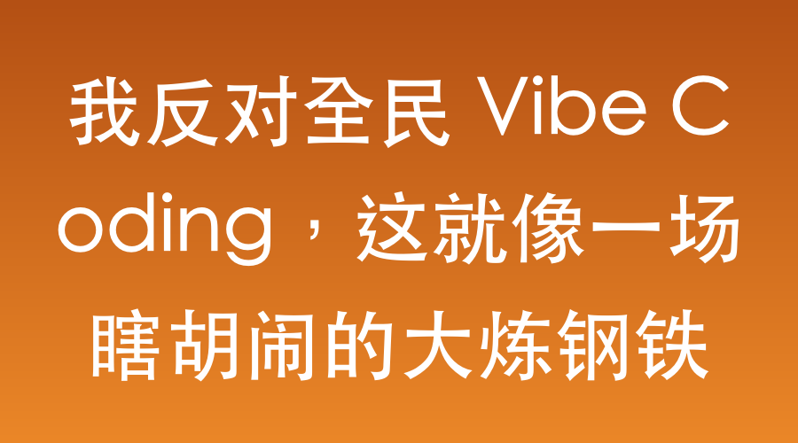

# 我反对全民 Vibe Coding，这就像一场瞎胡闹的大炼钢铁

最近 Vibe Coding 这个词火得一塌糊涂。

这个概念最早是前 OpenAI 科学家 Andrej Karpathy 带火的，意思是开发者以后不用亲自手敲每一行代码每一个字母了，主要靠自然语言写 Prompt，顺着所谓“直觉”让大模型去生成代码。

说实话，为什么不叫逻辑编程，非得叫直觉编程？我觉得造出这个词的作者，心里多少是对它带着三分鄙视的。但不曾想，现在这玩意儿竟然流行全世界了。

一开始我也觉得 Vibe Coding 挺新鲜，但现在，我坚决反对。

在我看来，现在的全民 Vibe Coding 就像当年的大炼钢铁，里面充满了极大的浪费和无意义的重复性劳动。写代码终究是需要一点门槛的。这就好比炼钢，如果大家不是仅仅为了给自己铸一口锅、打一把勺子这种自娱自乐的小物件，就应该把力量联合起来，几个人或者十几个人一起搞个大的铸件工程。

当满世界都是散兵游勇式的干活时，只要有一小撮人组织起来，这个小团队就是最有力量的。

现在这种全民养虾、全民 Vibe Coding 的狂热，我感觉就是那些生产 Token 的大厂商合谋编织的一个笑话。这就好比有大厂专门造了炼钢的小炉子、小煤块，卖给个人让大家在后院里瞎折腾；又像极了厂家生产出给小孩玩的过家家厨具，让五六岁的孩子天天做饭玩。

你问五六岁小孩用玩具厨具煎的鸡蛋能不能吃？能吃。但这能成为全人类放弃正经厨房，都去吃过家家煎蛋的理由吗？

凡事都有辩证性，我也试着站在反面想了想，在什么情况下 Vibe Coding 会有点正向作用呢？

## 这个世界充满了小需求？

有人会说，这个世界并不只需要大件，现实中存在海量的、只需要一口锅、一把勺的小件长尾需求。

比如财务需要个脚本批量重命名一千个发票文件，零售店店主需要个简单的数据抓取工具。专业的工程团队根本看不上这种几百块预算的零碎需求。Vibe Coding 恰恰填补了这个空白，让不懂编程的普通人解决了眼前的微小痛点。代码写得像废钢又怎样？只要它在那个特定场景下跑通一次，使命就完成了。

但这有个致命漏洞。这些小需求确实存在，但它们很快就会被满足，且可以被低成本地重复满足。大多数工具被生产一次，就可以拷贝给无数人使用，根本不需要全人类去重复造轮子。

如果说全民 Vibe Coding 只是为了让大家借此学习编程，那没问题。但如果指望用它来填补长尾需求，那就太高估它的长远价值了。

## 它是编程抽象层次的再次跃升？

回顾历史，从打孔卡片到汇编语言，从 C 语言到 Python，每一次技术迭代都在降低门槛、隐藏底层逻辑。

当年写汇编、写 C 语言的前辈，看写 Java 的人可能也觉得是在过家家，不懂内存泄漏和指针的艺术。所以有人认为，Vibe Coding 只是抽象的又一次跃升，把编程语言彻底抽象成了自然语言。

我不否认在不远的将来全民都会编程，但我坚信，绝对不是目前大家吹捧的这种只靠直觉的 Vibe Coding。会变成什么，最后面有讲。

## 它可以干掉沟通损耗？

软件工程里有个致命弱点：沟通损耗。《人月神话》里早就说过，增加人手往往会让项目进度更慢。多人协作需要庞大的对齐成本、接口文档和没完没了的扯皮会议。

在这个逻辑下，有人觉得在 Vibe Coding 的加持下，一个有顶级产品思维和业务嗅觉的人，可以一个人包揽产品经理、前端和后端。他表面上是散兵游勇，实际上指挥着一支不知疲倦的 AI 军队。在极速试错的出海产品开发里，这种极致敏捷的超级个体比小团队更具破坏力。

这听起来极度合理，但完全忽视了人类组织进化的规律。

三五成队的小团队，沟通损耗本来就极低，还能发挥协作的力量。一个人带着 AI 摸索确实很快，但如果三五个人各司其职，每个人都带着一支 AI 团队一起探索呢？这三五个人就相当于三五十人、三五百人的火力，岂不是降维打击？

美国曾经爆发过个人淘金热，但那只是早期。后来真正赚钱的，全是靠重型机械和团队作战。竞争法则会让人清醒，大家迟早会停止一个人在后院角落里搞重复建设瞎胡闹。

## 伟大的产品都诞生于玩具？

克莱顿·克里斯坦森在《创新者的窘境》里提过，所有颠覆性技术刚出现时，看起来都像性能低劣的玩具。现在 AI 生成的代码确实充满了屎山逻辑和隐蔽 Bug，但如果有一天这个玩具进化了，能以极低成本凑合出一顿尚可的快餐，它就会彻底颠覆现有的软件外包和基础开发范式。

这个产品进化论很棒，但忽略了一个核心事实：历史上那些最初像玩具的伟大产品，并不是创造者故意把它做成玩具的。他们是受限于当时的条件，付出了最大努力。真正的进化，绝不会像过家家那样一开始就自我阉割上限，而是从第一天起就奔向星辰大海。

## 放弃直觉，回归指令与协作

把这些全捋一遍，我依然坚决反对 Vibe Coding 的概念炒作。

第一，它根本不该叫直觉编程，更准确的叫法应该是 Cmd Coding，指令编程。

这是人类用逻辑、用指令去指挥 AI 编程，这才是它该有的样子。靠感觉和氛围是写不出好软件的。哪怕有了 AI，人类编辑和介入的环节依然极其重要。特别是在做业务软件创新的时候，AI 经常会卡壳，这时候人类的品味选择和清醒的逻辑判定，才是真正的定海神针。

第二，虽然抽象层次提高了，但为了准确性和杀伤力，Cmd Coding 绝不能停留在过家家水平，它同样需要系统性的学习。怎么下达指令、怎么排查问题，都是有经验可以积累和传承的。

第三，协作永远是终极杀器。

一个人带着 AI 确实跑得快，但如果这样的人组成团队，跑得会又准、又稳、又快。

这就好比我拿了一把加特林穿越到原始社会，面对一群猛犸象，我宛如神明，一个人能抵一百个人一千个人。但等我的弹药耗尽时，当我饥渴疲劳时，原始人团队协作的碾压性优势就会体现出来。

在任何时代，最终被协作武装起来的团队，特别是经过学习武装起来的团队，力量永远大于个人单打独斗。未来的 Cmd Coding 时代，编程需要学习，如何带着 AI 进行团队协作，同样需要学习。

📅 2026年05月24日

