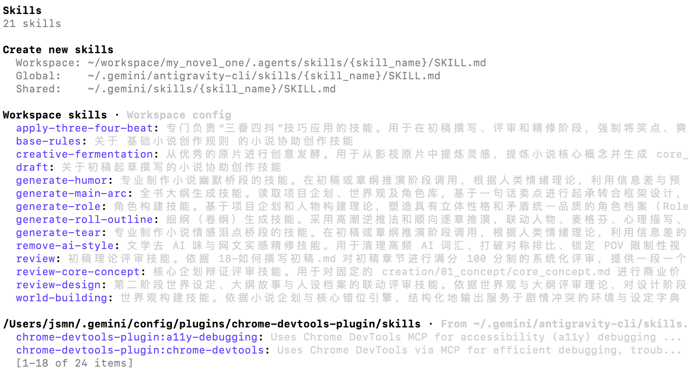

# 如何在 agy 中高效管理 AI Skill？

在探索 Antigravity CLI（agy）的过程中，我发现许多开发者存在一个认知误区：认为只需将一段 Prompt 存为 `.md` 文件并放置在相关目录下，即可被 AI 识别。

**事实并非如此。agy 对 SKILL 的识别有着严格的标准约束。**

为了确保大模型上下文窗口（Context Window）的利用率，agy 并没有采用原始的“盲扫目录”逻辑，而是深度践行了 **Agent Skills Open Standard（代理技能开放标准）**。在这种模式下，一个合格的 SKILL 必须具备规范的物理结构与元数据协议。

### 1. 核心标准：基于 YAML Frontmatter 的元数据发现机制

在 agy 的体系中，SKILL 的最小识别单元是一个**独立的文件夹**，且该文件夹内必须包含一个名为 **SKILL.md** 的核心文件。

最为关键的环节在于，`SKILL.md` 的顶部必须包含 **YAML Frontmatter**。这不仅是技能的标识符，更是其与模型通信的“契约”。

以下是我此前构建“文本去 AI 化”技能的规范路径与内容结构：

**物理路径：** `my-skills/remove-ai-style/SKILL.md`

**规范定义：**

```
---
name: remove-ai-style
description: 深度优化文本输出，精确过滤大模型常见的程式化表达与冗余词藻。
triggers: ["去除AI味"]
---

# Remove AI Style
（此处定义具体的执行逻辑与指令约束...）
```

**为什么 YAML 头部信息至关重要？**

这是 agy 维持高性能的关键设计。在终端启动时，系统并不会全量加载所有技能的完整内容，而是仅提取 YAML 中的 `name`、`description` 与 `triggers`等信息。

只有当模型在当前语境中识别到相关触发词（如“去除 AI 味”）时，才会按需调取并解析完整的技能内容。因此，**元数据定义的精准度，直接决定了模型自动触发技能的成功率。**

### 2. 挂载策略：三种 SKILL 管理方法

明确了结构规范后，我们需要通过合理的策略将技能挂载至 agy。根据开发阶段的不同，我通常采用以下三种方式：

#### **方案 A：基于软链接（Symbolic Link）的开发态挂载**

在技能的本地开发与测试阶段，我倾向于直接在 agy 交互终端执行内置命令：

`/skills link /path/to/my-skills/remove-ai-style`

这种方式的核心价值在于：它在 agy 内部配置目录中仅建立了一个**引用（Reference）**。这意味着我在原始开发目录中所做的任何修改，都会实时生效于当前的 AI 语境中，无需手动同步或重启，极大地提升了调试效率。

**进阶技巧：目录级映射与跨平台兼容**

当管理数十个技能时，逐一链接显然不符合工程直觉。更为高效的做法是：在项目根目录创建 `.agents/skills` 软链接，直接指向统一存放技能的物理目录（如 `system/skills`）。

```
ln -s /path/to/system/skills .agents/skills
```

执行后只需在 agy 中运行 `/skills reload` 即可实现批量挂载。这种做法不仅便于集中管理，更解决了一个现实痛点：不同 AI CLI 指定的官方路径各异，通过**软链接映射**可以避免在多个工具间重复拷贝代码，实现“一份源码，多端挂载”。



#### **方案 B：标准目录锚定（生产态持久化）**

若需使技能在系统中永久生效，可根据作用域将其放置在官方预设目录：

* **全局生效：** `~/.gemini/config/skills/<技能文件夹>/`
* **项目专属：** `<工作区根目录>/.agents/skills/<技能文件夹>/`

#### **方案 C：基于包管理器的工程化部署**

对于来自社区的开源技能，应优先采用标准的安装指令。这种方式符合现代软件工程的依赖管理逻辑：

`npx skills add https://github.com/repository/skills-repo -a antigravity`

参数 `-a antigravity` 明确了目标 Agent 环境。该命令会自动处理下载、版本验证及路径路由，是生产环境部署的首选方案。

### 3. 技能的卸载与动态控制

基于软链接的底层设计，卸载操作同样具有高度的灵活性：

* **指令化卸载：** `/skills unlink remove-ai-style`（模型将即时移除该上下文索引）。
* **物理层移除：** 仅需删除对应的软链接文件，原目录代码将保持完整。
* **工程化移除：** `npx skills remove remove-ai-style -a antigravity`。

**实战小技巧：**

若仅希望在单次 Prompt 中临时禁用某个技能，无需执行卸载操作，只需在提示词中加入显式约束：“Ignore the remove-ai-style skill for this prompt.” 大模型通常能够准确理解此类控制指令。

**最后总结一下：规范化的 SKILL 管理是高效利用 AI Agent 的基石。只有将 Prompt 封装为符合协议标准的 SKILL.md，才能真正实现 AI 技能的可发现、可复用与可管理。**

2026.06.02

📅 2026年06月02日