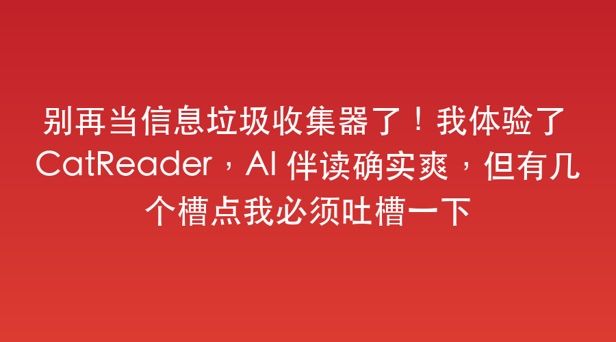

---
sync:
  wechat:
    url: x0aalz08UF8qMGuh3R5oiJRzoqHHvGT8dWOq45J3gW1yLWKAncrd543p18uy5kjj
    status: draft
    time: 2026-06-07T22:52:05+08:00
  blog:
    url: https://yishulun.com/43.html
    status: public
    time: 2026-06-07T22:54:16+08:00
---
# 别再当信息垃圾收集器了！我体验了 CatReader，AI 伴读确实爽，但也有几个槽点

我记得大概在 2024 年，我就在一篇笔记里狠狠感慨过：每天有太多信息要看，但它们像散落的珠子一样，散在独立博客、X 账号、各种 RSS 订阅源里。每天光是挨个儿获取，就得耗费大量无谓的时间。

在这个信息过载、外文满天飞的时代，我们到底是在高效阅读，还是在被碎片化垃圾信息掩埋？

最近体验了 CatReader（墨问共享 RSS 计划），它似乎就是为了解决我当时的这个繁杂痛点而生的。它不是简单地把网站收藏夹搬过来，而是把全球顶尖的 AI、科技、工程、商业和文化源做了一次大一统，还内置了一个叫 AskCat 的智能助手。

那么，这个号称 AI 驱动的知识入口，真的能拯救我们的阅读焦虑吗？它到底是实至名归，还是另一个噱头？

## 它凭什么能让我少走弯路？

体验下来，它确实不是个花架子。CatReader 提供了一套很直观的智能化阅读体验：

首先，海量 RSS 内容聚合。它直接把 OpenAI、DeepMind、Anthropic 等几十个顶尖 AI 实验室的官方博客，以及设计、文化、商业、科技等跨界内容一网打尽。海外优质的英文内容，它会自动抓取并进行高质量的翻译，双语对照呈现，对英语阅读有门槛的读者非常友好。

其次，它的核心灵魂是 AskCat。这绝不是一个外挂式的聊天插件，而是原生嵌入底层的 AI 伴读助手。它可以帮你翻译正文、一键总结要点、深度分析文章，甚至能调用你的长期记忆提供个性化问答。看长文章时，总结摘要这个功能可以让你秒懂核心大意。

而且因为它是 Web 形式发布的，在有 AI 的今天，想发布新功能也就是几句指令的事，产品迭代极其快捷。

## 吐槽两点

夸完了，我也要泼两盆冷水，这是目前非常体验的两个地方：

第一，信息源拓展极其被动。目前用户没法手动添加自己想要的自定义 RSS 源，全靠官方在后台手动添加。这让人有些憋屈，主动权不在自己手里。

第二，交互细节还有待打磨。阅读文章时，如果我对其中某一段话产生疑问，居然没法直接用鼠标划选并进行针对性问询。不过讲道理，这个 UE 体验改善在技术上并不难，估计不久就会迭代上来。

## 极简设计与底层技术

接下来我想看看它的设计。

在设计理念上，它采用极简且工程师友好的三栏布局：左侧导航分类，中间文章列表，右侧 AskCat 对话区。AI 不是外挂，而是直接读取当前文章内容和用户记忆，实现真正的无缝伴读。

在底层技术上，后台负责定时爬取海量 RSS、解析、分类并存储；中间或许依靠了大语言模型（LLM）配合类似 RAG（检索增强生成）技术，把上下文和用户长期记忆塞给 AI；前端支持流畅交互，配合缓存机制保证响应速度。

## 总结一下，我更期待它能读懂我的那一天

我每天读它，它也在读我。

总的来说，CatReader 已经脱离了传统 RSS 工具的枯燥，用 AI 自动化了信息获取中最繁琐的筛选、翻译和总结。

但如果非要提个终极追求，我希望它未来它能更懂我：不仅能自动汇聚知识，还能敏锐地洞悉阅读者的个人偏好，自动匹配个性化的信息源，而不是所有人都在看同一份标准答案。同时，又不受限于“信息茧房”。

2026年06月07日

