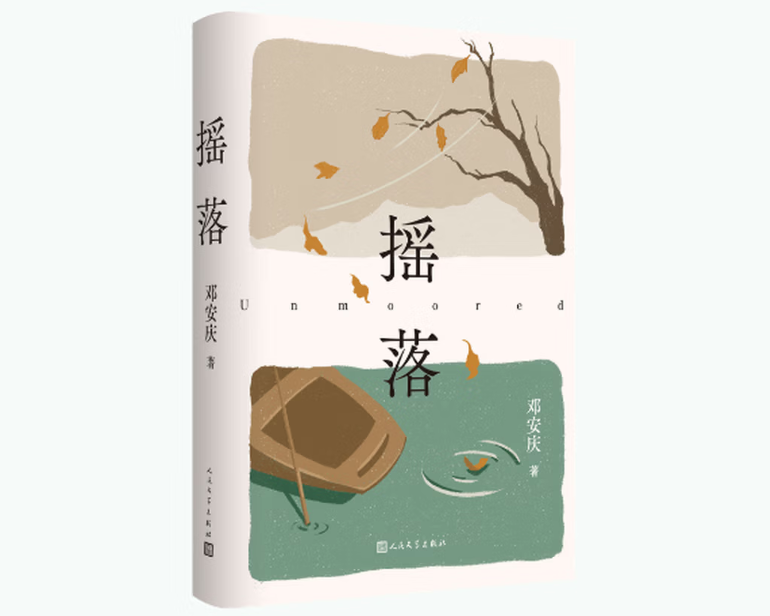

---
sync:
  blog:
    url: https://yishulun.com/47.html
    status: public
    time: 2026-06-15T15:22:54+08:00
  mowen:
    url: https://note.mowen.cn/detail/7g5VKRzTL_84k-MntIQXC
    status: public
    time: 2026-06-15T15:23:05+08:00
---
# 一场“认真”听的讲座

时间拨回2023年，墨问在奥森旁边搞了场讲座。

当时台上至少有两位讲师，一位是董事长，一位是邓安庆。董事长讲的内容，我现在一丁点都想不起来了。

但邓安庆老师讲的东西，以及当晚凑光和他一起吃饭聊的那些话题——**三年了，还在我脑子里住着，赖着不走。**

当时以为是闲聊吹水，邓老师的回答听起来也是云淡风轻，好像就是饭桌上随口扯几句那种。从饭店出来，我、刘超和邓老师三个人一起往地铁站走。灯光从上面打下来，照得树影斑驳，我们刚好走到一棵银杏树底下，邓老师刚好聊到“创作的灵感”。

他说了一句让我记到现在的话：“**有时候灵感就像我们头顶的枝叶，我们没有抬头，但我们看到地上的树影在晃，就知道它来了。**”

那个画面至今还能在我脑子里播放：三人并行走在奥森公园的街道上，路边是枝叶稀疏的银杏树，再往上是路灯，再往上是月亮，是晴朗的夜空和谈谈的云彩。我是回忆者，但我也在这个画面里。

我不知道墨问为什么会请邓安庆老师来，说实话当时我也没觉得这有什么特别的。**直到今天我才慢慢品出来——请的真好。**

## 浅显的文字，浓烈的深情

我不知道有多少人像我一样，一直追着邓老师的微信公众号（账号名字就叫“邓安庆”）。

三年来他一直在更新，不紧不慢。这期间发生了一些事，他的父亲去世了，他的母亲照顾了他患病的父亲二十年，他甚至写过要让母亲离家出走。但在父亲真正离开后，在母亲看似解脱之后——**他又开始一遍又一遍地怀念父亲。**

他在地铁里看到有人穿了一双魔力扣运动鞋，他想起给他父亲买过同款。在一个下雨的午后，或者某个吃晚饭的傍晚，他突然想起从来不做饭的父亲给他做过一顿饭：米饭夹生，菜很咸，鸡蛋汤里漂着蛋壳。那顿饭难以下咽，**但他说，想再吃一次。**

读到这些文字的时候，我慢慢明白了一件事：邓老师的文字看起来浅易，但其实不简单。

我之前在笔记里写过一句浅薄的话，说“写墨问很容易，就写邓老师那样朴实的文字就行”。那时候我是真不懂。直到追读了他三年公众号，我才发现自己理解得浅了。**邓老师的文字虽然浅易，但每个字缝里都藏着浓到化不开的深情。**

打个比喻，就像大写意山水，笔画简单到极致，却浓墨重彩深藏意蕴。你以为你也能画几笔，但你画出来的，和郑板桥、齐白石画出来的就差远了。

## 此情可待成追忆，只是当时已惊叹

李商隐有句诗叫“此情可待成追忆，只是当时已惘然”。**我不惘然，我改成了惊叹。**

最近邓老师出了新书《摇落》，有位同行给他写了篇推荐文，邓老师在公众号上转载了。那篇文章叫《当邓安庆不再写老好人》，写得是真好。读完之后我才懂，当你身处当时，你很难理解某些境遇的分量，只有多年后回头看，才晓得多珍贵。

《当邓安庆不再写老好人》这位作者观察之细，文笔之“毒”，让我倒吸一口气。是“毒”，也是真。在小说创作者的世界里，在那些真正把写作当成生命的人身上，我才慢慢看清楚“真”到底有多重要。邓老师身上就带着这种真。但挺遗憾，世俗里每天熙熙攘攘忙着赶 KPI 的大多数人，身上是很少见到这个东西的。

现在再回想起那次和邓老师的相识、聊天，我只能说——**那次活动，邓老师请的真好。**

**如果你读到了这里，希望你有时间去看看邓老师公众号的那篇推荐文《当邓安庆不再写老好人》，也去看看他的新书《摇落》。** 有些文字，就像那天晚上奥森银杏树下的灵感一样：你不用抬头，只是看到地上的光斑在动，你就知道有什么东西已经来到了你身边。

2026年06月15日
