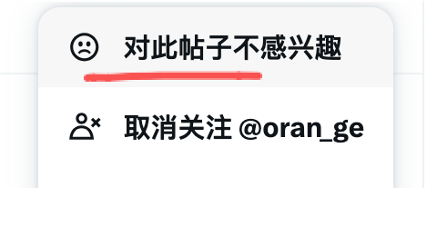

---
sync:
  wechat:
    url: x0aalz08UF8qMGuh3R5oiI_ZHaZzSdvemnuwWo6UoLEhlM0WTqwuFI_8RvMNn2vD
    status: draft
    time: 2026-06-18T11:28:03+08:00
---
# 她一年涨 7 万粉，只用了这几点社交平台的“笨办法”

你是不是也觉得，现在做社交平台账号，没点资本、没点资源，根本起不来？

看着别人动辄几万的点赞，再看看自己两位数的阅读，那股子倦怠感就上来了。

但我最近在 X 平台刷到 @Zara Zhang 的复盘，她用一年时间攒下 7 万真实粉丝。

方法不玄乎，甚至有点“笨”。我结合自己在日常输出和用 AI 的一些心得，把这里头的门道掰开揉碎，跟你聊聊。

**开局先别急着说话，去大佬评论区“借光”**

很多人把社交平台当成广播站，一上来就咔咔发内容，指望流量从天而降。

别做梦了。你把平台当成一个 Party，你得先钻进别人的谈话圈子里，听得进去话，才能插得上嘴。

最直接的，就是去评论区“蹭大佬流量”。这招有点“冒犯”，我知道。有些大 V 表面不说，心里烦死评论区那些甩链接的家伙。

但说实话，对于带着脑子来交流的人，我个人的态度是完全开放的。你尽管来我的墨问笔记下方插链接，只要言之有物，我绝对欢迎。

关键是，你别光当捧哏。在围观大佬的同时，把你的原创观点亮出来。平台推流的底层逻辑，是“唯质量”，不是“唯大号”。哪怕你现在一个粉丝都没有，只要观点够犀利，算法照样推你上热门。原作者那篇爆款经验贴，本身就是这一点最好的证明。

**把算法当“牲口”驯：喂它好的，但别让它把你圈养了**

你想混科技圈，就别让算法给你推婆媳吵架。你想聊投资，就千万别手贱点那些搞笑的猫猫狗狗。

对无关内容，直接点“不感兴趣”；对高质量内容，疯狂点赞、走心评论。这套操作下来，大概需要 2 到 4 周，你的信息流才会长成你想要的样子。这是“驯服”算法的第一步。

但这里有个坑：信息茧房。算法把你伺候得太舒服了，你就看不到外面的世界了。

我的做法是，不仅要训练它给我投喂，还要偶尔打破它。主动搜索一些破圈的信息，这是保持新鲜感的“解药”。搜索这个功能，千万别荒废了。既要让算法听话，又要防着它把你当成傻子。

**互动别用“机器人”，但枯燥的体力活全扔给 AI**

现在很多工具能自动回复，这玩意儿是毒药。

跑到行业大 V 底下，写一条走心的、几十个字以上的评论。对方点进你主页一看，是个活人，可能顺手就点个关注。算法一看，立刻就把你俩圈进同一个圈层，开始给你推流。真诚，是最高级的“套路”。但通往真诚并不需要什么道路，真诚本身就是道路，我们要坚决反对那种自动化的垃圾回复。

但是，这不代表我们要排斥工具。

对于那些重复性高、毫无灵魂的操作，请果断把活交给 AI。比如，前面说到调教算法，你要点“更多”，再点“对此帖子不感兴趣”，多费劲？

直接写个脚本，用 AI 把这个按钮搞到最外层。你只需要轻轻点一下，麻烦事儿全解决了。省下的精力，拿去好好写评论，不香吗？

**天天发就能火？警惕“输出垃圾”，预防“白嫖预期”**

把发帖变成日常习惯，让大脑像呼吸一样去输出。

给你三个“公开”学习法：一，公开学习，看到好观点就分享并标注原作者；二，公开反馈，体验了新 AI 产品，直接写真实感受 @ 创始人，大佬翻牌的概率极高；三，公开建设，自己做的破 demo、失败的原型、瞎捣鼓的录屏，全发出来。

高频是好事，但它应该是结果，不是枷锁。一旦从“条件反射”沦为“无脑输出”，你今天的心情流水账只会稀释你的专业品牌。质量与频率的乘积，才是你最终的影响力。这里有个技巧，建议学会用平台的“定时发布”，把节奏把控好。

还有个更扎心的事实：如果你一直闭口不谈钱，一直免费给干货，你的粉丝就会形成“绝对白嫖预期”。等哪天你突然开始收费，他们会骂你割韭菜。

更聪明的策略是，从一开始就坦荡地确立商业边界。大方承认，我不是免费的布道者，有些深度服务和有价值的信息，是需要付费的。免费的照样给，但收费的，别羞于启齿。

**别让“粗糙”当借口，那是 AI 能帮你擦干净的屁股**

先利他，再利己。让别人先觉得你这人真诚、有脑子、有判断力，才有后面的事儿。

在个人风格形成前，粗糙但真实的表达，胜过 AI 味十足的包装货。

但“真实”不意味着你要刻意保留错别字和糟糕的排版。把你的核心观点保护好，把那些非创意性的、让人读起来费劲的粗糙感，全部扔给 AI 处理。让 AI 帮你把满地的木屑扫干净，只留下木头原本的香气，这才是工具的意义。

后社交时代，不论在 X 平台还是微信公众号，增长的本质就一句话：持续出现在正确的圈层里，结硬寨，打呆仗。

用真实、有价值的表达慢慢垒砖，保持人味儿，同时绝不排斥用 AI 把枯燥的体力活干掉。

这才是最高效的破局之道。

2026年06月18日
