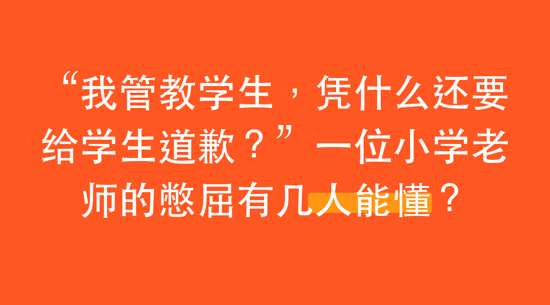

# “我管教学生，凭什么还要给学生道歉？”一位小学老师的憋屈有几人能懂？

（以下我讲两个真实的教育故事，为了叙述方便，我以第一人称教师视角进行讲述。）

活久见。

我当了这么多年老师，昨天因为管教一个上课捣乱的学生，被家长堵到校长办公室，要求我——一个人民教师，当着他们全家人的面，向那个三年级孩子公开道歉。

更绝的是，三位校长听完家长诉求，非但没袒护我，反而扭头就做我的思想工作：“X老师，什么也别说了，你马上道歉，态度诚恳一点。”

那一刻，我真是打心眼儿里觉得憋屈。

我图什么呀？还不是图学生上课能消停点认真听课，期末能考个好成绩。

最近不是快期末考试了嘛，学校抓得紧。我们班有个叫小明的，脑子特别灵，就是屁股上长钉子，坐不住。那天上课，他跟旁边同学在课上打闹，声音大得盖过了我。我火一下就上来了，喊他：“小明，你到教室后面靠着墙站着，什么时候安静了，什么时候回来。”

他气鼓鼓地站了十分钟，自己跑回来了。我也没再追究。

结果第二天，他爷爷、爸爸、妈妈，一家三代人，整整齐齐地坐在了校长办公室。

控告我**体罚学生**。

我当时脑子里“嗡”的一声。罚站十分钟，这就体罚了？

你可能想说，学生捣乱，为什么不把他赶出教室站着？

对不起，真不敢。现在教育局有明文规定，严禁体罚。把孩子赶出教室更不行，上课期间，老师得对全班孩子安全负责，不能让学生离开老师的视线。

像鲁迅的私塾先生那样打手板？呵，想都别想。连小小的罚站都是红线。

小明爷爷，一位六七十岁的退休老干部，据说以前就在教育口干过。人家门儿清，几句话把三位校长说得服服帖帖。

老爷子说了，让学生站着，就是体罚，就是不对。你管不住学生，是你这老师无能，是你没本事吸引孩子100%的注意力，是你失职。

好嘛，道理全是他的。

我憋着一肚子委屈，走到小明一家人面前，硬挤出一副诚恳的样子，说：“小明的爸爸妈妈，爷爷，昨天是我着急了，教学方法过于粗暴，我检讨。以后这样的事，不会再发生了。”

老爷子看我态度还行，没太为难我，给我上了一课。他说：“教育是件大事，教育工作很累。但不管什么情况，都不能体罚学生。孩子爱动爱说话是天性，当老师的，得努力修炼专业技能，用个人魅力吸引孩子的注意……”

我站着听，点头，表示受教。

关于小明的故事，就到这儿了。

我再讲个另一位学生的事。

小静，是个聪明活泼的小姑娘。她最近迷上了跳绳，练得特别好，不久还要公费代表学校去外地比赛。这孩子一兴奋，上课时手就放在课桌上绕来绕去，脑子里还在过那个跳绳动作，走神了。

我发现了，板起脸说她：“小静，干嘛呢！课上专门听讲，课下再好好练跳绳。你再走神，老师可生气了，再也不理你了。”

换了一般孩子，可能吓得不敢说话，或者跟你顶牛。

你猜小静什么反应？

她一听，立马急了，张口就来一句：“老师，你别生气呀，你一生气就不漂亮了！”

说完，又是扮笑脸，又是做鬼脸，求饶说：“老师我上课再也不练跳绳了，原谅我吧，我再也不敢了，我可怕您不理我了。”

就这么一句话，我心里那股火气，瞬间全灭了。

看着那张调皮可爱的小脸，我怎么可能还生得起气来？我只能强忍着笑，丢下一句：“好好听讲，下不为例。”

好，两个故事讲完了。

一个是全家出动，逼着老师给孩子道歉。

一个是几句话，哄得老师没了脾气，一笑而过。

你看明白了吗？

现在的教育，到底出了什么问题？

就像我今天回复一位墨友说的，现在教育最大的难题，往往不在孩子身上，而在于孩子身后站着的，爸爸妈妈、爷爷奶奶、姥姥姥爷那一大家子。

小明的爷爷，他赢了吗？表面上看，他赢了。老师低头了，孙子再也不用罚站了。

可小明呢？

他有没有意识到，上课随意说话、打扰别人，是错的？他学会怎么跟老师友好相处了吗？下次他在学校再受一点儿委屈，是不是又要哭着跑回家，把爷爷这尊“大佛”搬来？

一个在校园里，连一点点课堂规则意识、一点点对师长的敬畏心都没了的孩子，以后怎么去适应更大的社会规则？

而小静，她就很明白一件事：老师管她，是因为在乎，是为她好。她知道用好听的话去化解矛盾，知道给老师一个台阶下。这不是“滑头”，这是一个孩子**高情商**的表现，是她在学校这个精简的小社会里，习得的最宝贵的相处之道。

在学校里，怎么跟老师相处，本就是孩子们人生的必修课。

所以，什么才是好的家庭教育？

不是把孩子裹成一只碰不得的刺猬，一上学就竖起全身的尖刺，等着去扎那些想要管教他的人。而是让孩子打心眼里明白，老师管你、问你、甚至批评你，那是累、是苦、也是对你的责任。

只有在家里，家长先懂得体谅老师的辛苦，带头尊重老师，而不是动辄告状、动辄打12345，你才能引导你的孩子，学会如何友好地、聪明地跟老师相处。

这才是真的爱孩子。

2026年06月18日

