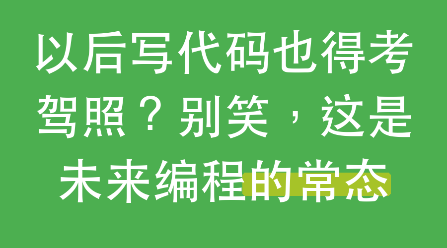

---
sync:
  wechat:
    url: x0aalz08UF8qMGuh3R5oiKMiaoKitiohIpe2yIOtdlYLY8EdbblKWotbe6AF6SHa
    status: draft
    time: 2026-06-21T08:25:25+08:00
  blog:
    url: https://yishulun.com/52.html
    status: public
    time: 2026-06-21T08:26:03+08:00
  mowen:
    url: https://note.mowen.cn/detail/yoGdo2yD1guLRLSwmIGFz
    status: public
    time: 2026-06-21T08:26:55+08:00
  cnblogs:
    url: https://www.cnblogs.com/sban/p/20674183.html
    status: public
    time: 2026-06-21T08:27:01+08:00
  toutiao:
    url: https://mp.toutiao.com/profile_v4/manage/content/all
    status: public
    time: 2026-06-21T08:27:42+08:00
  x:
    url: https://x.com/jinshimanong/status/2068491200122826957
    status: public
    time: 2026-06-21T08:28:42+08:00
---
# 以后写代码也得考驾照？别笑，这是未来编程的常态

你现在觉得编程是个挺高深的活儿，得像黑客一样敲命令行，屏幕刷刷刷闪来闪去。

但说实话，再过些年，编程可能就跟开小汽车一样普通。

而小汽车本身，那时候大概早被 FSD 取代了。那时候国家操心的是：你会不会无意间把公共机器弄坏。

于是，未来的世界里，很可能出现一个考试——编程资格考试。

不是今天这种计算机等级考试，没那么玄乎。难度大概和你去考个驾照差不多，只是为了避免有人随手写几行代码，就把街上的机器人、公共屏幕或者什么共享设备搞瘫。

只有拿到合格证书的人，才被允许在公众机器上使用编程技能。

## 那未来的编程语言，会是哪一种？

它应该不是现在任何一种语言。

它会是自然语言。

我给你看个例子：

在这个截图里，“novel-sop”是一个可以调用的 SKILL 模块。注意，事实上它不是单个 SKILL，而是一个 SKILL 集合。并且这个 SKILL 集合也不是公开的，你应该在网上搜索不到内容。

N 和 Y 是变量，我在这里给它们赋了值。

而“步骤 7.7.1”，就相当于一个函数。它是我编写的，我马上就要调用这个函数，让它去执行某些操作。

看到没有？这是汉语，是自然语言。

未来的公共编程语言当然不只汉语，英语和其他语言都可以。但有些基础概念会是通用的，比如变量、函数这些。

## 编程考试到底考什么？

考的内容无非就是变量、函数这些基本概念，甚至还可能包括怎么自己写函数。

比如刚才那个“novel-sop”，如果要你自己写出来，这技能大概就相当于开大卡车。

我们知道驾照本身是有等级的：C1 只是普通小轿车，A1 是大型客车，能向下兼容所有车型。

编程执照也一样——只会调用别人写好的函数，可能就是 C1 水平；能写复杂的模块、能设计 SKILL 集合，那可能就是 A1，被允许碰更多公共机器。

编程这件事，说到底，未来不是要被贡起来，而是要变成人们的一种日常能力。

2026年06月21日

