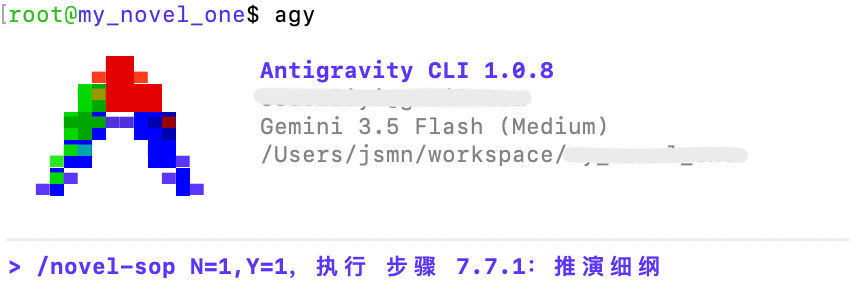
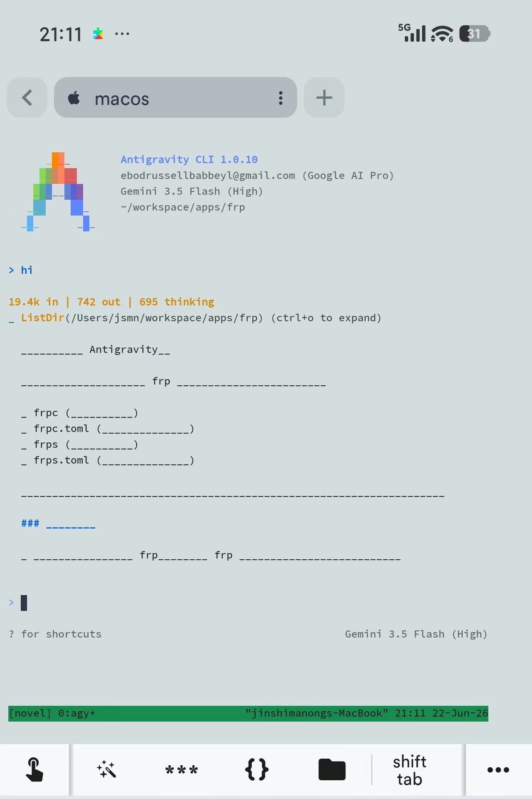

---
sync:
  wechat:
    url: x0aalz08UF8qMGuh3R5oiM1cF7EyiVUm49S9cSQtVNIe5Yd0tVaO39qt4ncF-xFw
    status: draft
    time: 2026-06-22T22:16:42+08:00
  blog:
    url: https://yishulun.com/54.html
    status: public
    time: 2026-06-22T22:18:00+08:00
  cnblogs:
    url: https://www.cnblogs.com/sban/p/20713439.html
    status: public
    time: 2026-06-22T22:18:03+08:00
  mowen:
    url: https://note.mowen.cn/detail/FiaktposTyGZYf7pS0xDx
    status: public
    time: 2026-06-22T22:19:58+08:00
  x:
    url: https://x.com/jinshimanong/status/2069063038401945765
    status: public
    time: 2026-06-22T22:20:54+08:00
  toutiao:
    url: https://mp.toutiao.com/profile_v4/manage/content/all
    status: public
    time: 2026-06-22T22:22:20+08:00
---
# 别做网页了，以后智能体就是交互终端

我比以往任何时刻都坚定这个想法了。

以后智能体（Agent）就是终端，什么页面按钮、表单统统不存在了，任何互动产品终端都是一个 Agent，App 是一个 Agent，整部手机也是一个 Agent。像今天的 Codex 或 CC 那样，可以输入文字，可以输入图像，可以输入语音；它能返回文字、表格、文档、图像、音频、视频等一切格式的内容。不像传统网站那样，输入无固定格式，输出也无固定格式。

计算机在早期的时候是一个互动终端，发展几十年，有了 AI 之后，现在又回去了，也是一个界面一个互动终端，什么窗口、什么文件，统统不需要了。你回想一下现在天天点来点去的那些页面上或 App 上的按钮和表单，将来回过头看，可能就像看古董一样。

那问题来了：人怎么和这个终端交互呢？

用一种通用的自然语言 + 符号 + 数字的新编程语言。

来看一个例子：



这里的 novel-sop 是我编写的一个 SKILL SOP 模块，我可以直接调用，当然也能随时修改它。N=1、Y=1是我输入的变量，注意我用的逗号比较随意，中英文都混用了，但没关系，AI 照样准确识别。这就是 AI 时代互动编程和传统编程最大的区别——传统编程讲究一切都要精确，错一个标点、错一个字母都跑不起来；AI 时代不一样，输入要求没这么严，就像我们人类面对面交流，语音标不标准、发音准不准都没事，大差不差都能理解。

步骤 7.7.1 相当于我在 SKILL SOP 模块里写的一个函数，我将要执行它。

在未来的编程活动里，变量、函数、定义、调用这些基本概念也会有，但它比现在通用得多。有了这种编程语言，人可以把精力都投入到创意中去，让一切重复枯燥的苦活交给机器。

上面的示例是在我的 macos 本机上，在终端 Antigravity CLI 里执行的。这个创作活动有很多步骤，AI 按我的想法去干苦活，把结果给我看；我看了之后，提了意见，它再去改。整个过程，我的精力就只用在创意上。如果我对执行结果不满意，或者对互动过程不满意，我还可以回头改我的 SKILL SOP，因为这个 SOP 本身就是我自己编写的。

所以，你明白了吗？以后，电脑不是主流，手机会比电脑普遍一些，但手机也不是唯一的。智能眼镜、智能手表，一切能和 Agent 交互的界面都可以。电脑，因为它要把人绑在桌子前，会慢慢被人类扔掉，慢慢走进历史的舞台。

但话又说回来，当前这个时代，咱们还实现不了完全抛弃电脑。可是，如果我实在不想坐着，我就想边散步，边构思，边指导 AI 干活怎么办？

也有办法。只需要三个软件就能做到，我已经实现了。

## 一、使用frp

首先，电脑与手机不同环境互通，要先实现电脑的内网穿透。可以用全能的 Tailscale，这个软件太强悍了，它能把电脑、手机装在一个 100 开头的虚拟局域网里，既然在同一个局域网，不要说连接，连共享文件都可以。但这个软件我没用，因为在手机上它会开 VPN，一开 VPN 就会把系统的 VPN 挤掉。我用的开源软件 frp，在一个轻量服务器上开启 frps，端口 60022；在 macos 本机开 frpc，把服务器的 60022 端口映射到本地 22 端口。稍后我们在手机上连接 macos，连接的是服务器的 60022 端口。

## 二、使用Termius

接着，在手机上装一个 Termius 软件。这软件也是个神器，它能连我的服务器，接着穿透到 macos 本机，运行我 macos 机器上的 Antigravity CLI 软件，也就是 agy。

# 三、使用tmux

最后，还有一个问题，就是进程共享。这要用到 tmux。它的作用是将在服务器上运行的进程，与 SSH 连接本身分离开。这个官方描述有点拗口，换种说法，就是复用进程，不间断地继续用。举个例子，我在手机上用 Termius 连 macos 的 22 端口，启动 agy 软件，交互了一会儿，回 macos 本机上我想接着搞怎么办？原理上，ssh 连接属于不同进程，在 macos 上都看不到，是不能复用的。

这时就可以用上 tmux。

三行命令就够：

```
tmux new -s novel
CMD/CTRL + b，d
tmux a -t novel

```

第一行，在手机上启动一个叫 novel 的共享进程，接着再用 agy；第二行，退出当前工作；第三行，在 macos 本机接上之前断掉的工作，所有 agy 互动历史、提示语记录都在，可以无缝衔接。反过来在 macos 本机开始的工作，在手机上也一样能无缝续上。

下面这张截图是手机截的，截图里的 hi，启实是我在电脑上敲进去的，现在控制权换到了手机上，我又可以在手机上继续互动了。而且，不管是散步还是坐车，都能互动。



神不神？方便不方便？

输入法还可以用自己喜欢的，例如微信输入法，支持语音输入。手机屏虽小，但有了语音输入，效率其实比在电脑上打字还高。

再加上我的 token 现在基本用不完，已经到我的精力上限了。我目前对这种“创新编程方式”非常满意，不知道你感觉如何。我觉得未来主要的编程方式，就是我这种。

2026年06月22日


