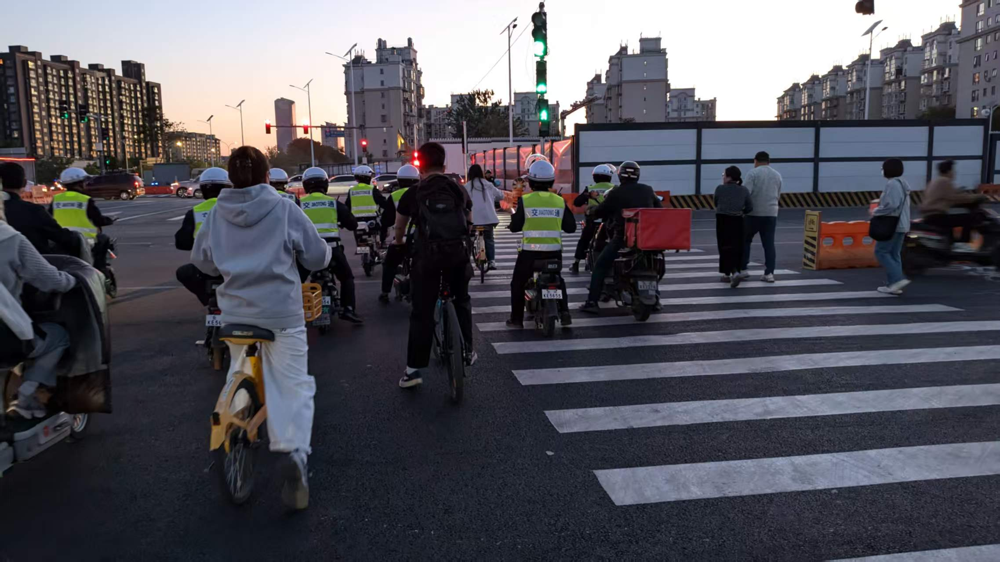
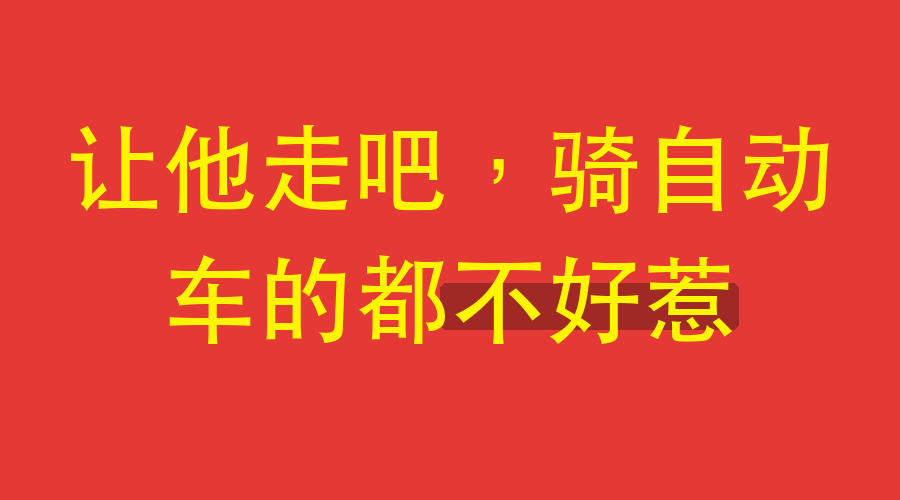

---
sync:
  mowen:
    url: https://note.mowen.cn/detail/_kssM6tifDMqwuX3DQPAH
    status: public
    time: 2026-06-23T13:02:49+08:00
---
# 让他走吧，现在骑自动车的都不好惹

气消了，把昨天的小事撰文以记之。

昨天我骑单车路过一个高速岔路口，转过路口进入高速桥下，我看见几个穿绿色上衣的执法小哥迎面挡住了我。一个胖哥伸手示意我停下，我将车头往左偏转，几乎要偏到机动车道上了，他还在挡我，我只好停下来。

当我停下来的时候，我发现左后面一辆黄色外卖小哥也停了下来。噢，原来不是拦我。小哥穿黄色外卖圣衣，头戴黄色头盔，所骑工具也是平台标配，很标准，我不知道绿衣胖哥为啥拦他。

外卖小哥大喊：“让开，别挡路，让开！”

外卖小哥的话提醒了我，“别挡路”，对啊，绿皮小哥执法也不能拉在路中间。

我拿出手机，把一张旧照展示给绿皮小哥：

“请问大哥，图中这位小哥他违规了吗？过马路电动车能压斑马线吗？他是不是应该下车推行？”

“你管他干吗？”对我的多管闲事，绿色小哥们很有意见。

“已不正何以正人！请问他违规受到应有惩罚了吗？一个自己都不能严格守法的队伍，如何有脸让老百姓严格守法？”

我也火了。

我开始拍照，特别拍了几位绿皮小哥身上的工作号码，“我要举报你们！你们今天遇上我，算你们走运。”

“你举报谁？你当你是谁？你不要乱拍照，不许拍照，把手机收起来！”绿皮小哥意图阻止我，开始拉扯了。

我说：“宪法赋予我了监察的权力，我感到不满的，我就要举报！并且，我要教育一下你们，请你们听好。”

“一看你们小时候就是不好好学习，长大了还要老师费神教你们。”

“听好，公职人员法无允许则禁止，市井百姓法无禁止则随意。我问你们，法律允许你们拦在路中间执法了吗？”

我大声质问他们，现在外卖小哥的事已经不是事了，挡他的胖哥也停下来加入了我这边的对抗。

“任何法律都没有允许你们可以大白天光明正大挡在路中间执法，任何法律都是以‘安全第一’、‘生命至上’放在首位的，你们挡在这里，已经对我等的行驶安全造成潜在的危害。”

“我不应该举报你们吗？我必须举报你们！”

我开始拍照，特别注意拍他们衣服上的号码。他们仍然想阻止我。

“你们是听不懂吗？公职人员法无允许则禁止，你们是公职人员，你们穿着这身皮，你们可以行使的公职权力是有限的，哪条法律规定你们可以阻止公民拍照？”

“我警告你们，我已经开启录音了，请注意你们的言行举止，你们说的每句话将来都可能成为呈堂证供！”

这时候，一拉绿皮小哥把手附在另一位绿皮小哥耳边，小声说了一句话，但被我听到了，他说：“你看他梳大背头，穿大裤衩，穿运动鞋不穿袜子，一看就不是软茬。”

又说：“你听说了吗，区领导现在就喜欢骑自行车。让他走吧，现在骑自动车的都不好惹。”

他们嘀咕一阵，达成一致，不再阻止我拍照，也不再和我扯皮说话，去和外卖小哥继续掰扯了。

我感觉索然无味，骑车离开了。

昨天天气不错，没想到遇到这等事，真是影响心情。

教员当年是对的，有些人就是背离了初心。

2026年06月23日

