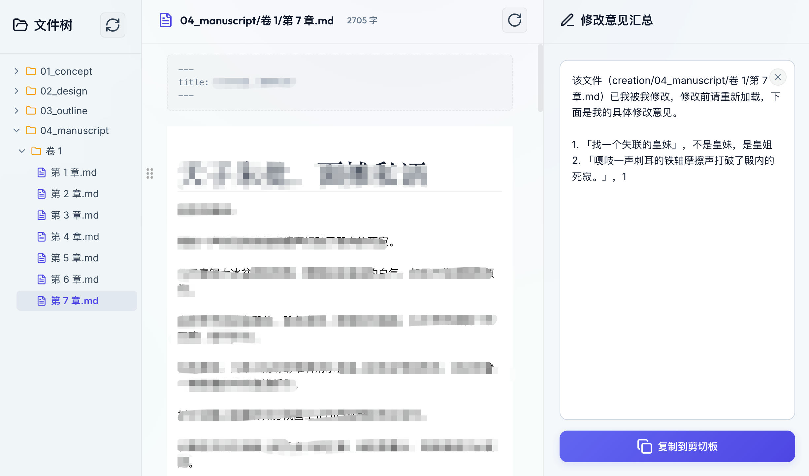
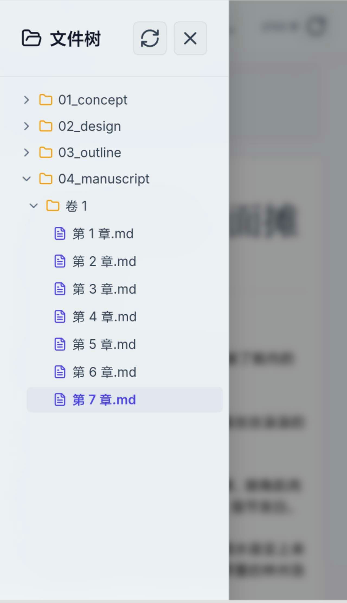

---
sync:
  wechat:
    url: x0aalz08UF8qMGuh3R5oiDhKClT7RNwCCLBrBXeja4UQKtcroey1LF7AMaP9Munj
    status: public
    time: 2026-06-23T18:30:59+08:00
  cnblogs:
    url: https://www.cnblogs.com/sban/p/20743304.html
    status: public
    time: 2026-06-23T18:31:47+08:00
  blog:
    url: https://yishulun.com/56.html
    status: public
    time: 2026-06-23T18:31:49+08:00
  mowen:
    url: https://note.mowen.cn/detail/dVsF3MTeiHGmkEkLwI1II
    status: public
    time: 2026-06-23T18:31:57+08:00
  x:
    url: https://x.com/jinshimanong/status/2069368037652754844
    status: public
    time: 2026-06-23T18:32:58+08:00
  toutiao:
    url: https://mp.toutiao.com/profile_v4/manage/content/all
    status: public
    time: 2026-06-23T18:33:31+08:00
---
# 太不真实了！以前一周的活儿，现在一天干完，连边框都得听我的

在以前，传统手动编程，搞这么一个 case，至少也得一周时间吧。现在一天就搞定了，啥感觉？我到现在还觉得有点不太真识。

今天我让 agy 帮我搞了一个项目，没想到一天就搞定了！

我对细节还比较挑剔，例如边框之类，必须按照我心目中想象的来，如果要求不这么高，agy 可以搞得更快。它基本不卡壳，它可以充分理解我的产品需求，然后在执行时，一遍过。

它还是个响应式布局，同时支持在 PC 和手机上查看。

并非只是查看，它还可以保存。

我用 frp 实现了电脑的内网穿透，然后这个小工具让我在手机上，随时随地可以修改我电脑上的文本内容。

AI 带来的变化都感觉有些不真实，但却实实在在地发生了。

2026年06月23日

