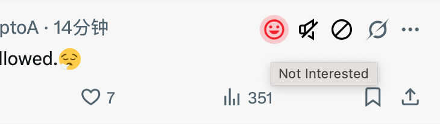
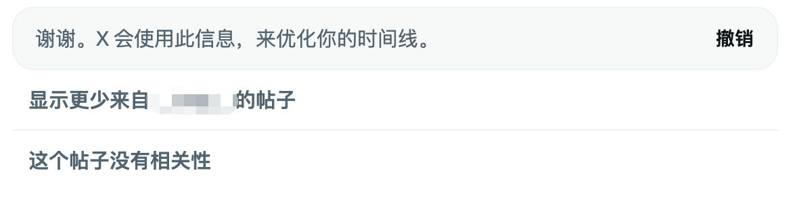

---
sync:
  wechat:
    url: x0aalz08UF8qMGuh3R5oiHkRMH5M29hAy-204LO6FshQPx_Pfikss46H3sOg6MrG
    status: draft
    time: 2026-06-25T08:47:51+08:00
  mowen:
    url: https://note.mowen.cn/detail/yzZUjrIaweUyqqIVtiJxQ
    status: public
    time: 2026-06-25T08:48:33+08:00
  blog:
    url: https://yishulun.com/58.html
    status: public
    time: 2026-06-25T08:48:46+08:00
  cnblogs:
    url: https://www.cnblogs.com/sban/p/20786504.html
    status: public
    time: 2026-06-25T08:48:57+08:00
  x:
    url: https://x.com/jinshimanong/status/2069946131904139307
    status: public
    time: 2026-06-25T08:50:02+08:00
  toutiao:
    url: https://mp.toutiao.com/profile_v4/manage/content/all
    status: public
    time: 2026-06-25T08:51:01+08:00
---
# 只用了 3 分钟，我把那个按钮钉在了主页上

之前分享某位大佬的社交媒体账号运营秘籍时，提到过要把“对此帖子不感兴趣”这个按钮，从三个点（…）菜单里拿出来，以方便点击，现在做到了：

并且，在有 AI 的时代，做到这件事只用了不到 3 分钟的时间。

所有常用的功能按钮，都应该放在容易触摸到的地方。现在点一下小笑脸，X 就明白了我的喜好。

还有，并不是所有用户都有同样的观念和使用习惯，这也就是说，为十亿用户提供界面一致的软件，这件事是不和理的。即使再加两个版本——儿童版、老年版，也是不合理的。

合理的做法是，每个人都可以定义自己的软件界面。都可以把自己常用的功能按钮，放在最容易找到的地方。

有人认可吗？

2026年06月25日
