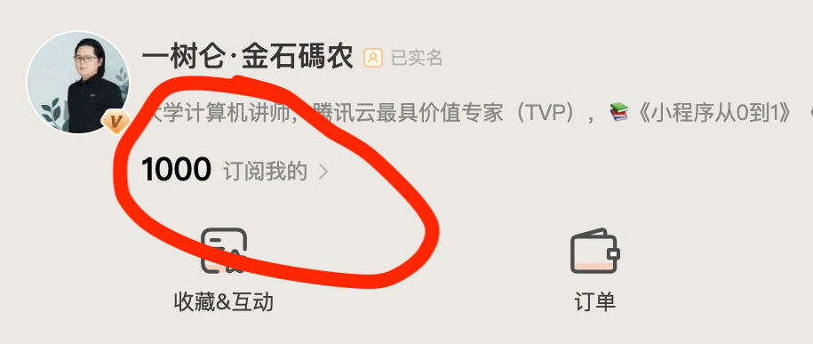

---
sync:
  mowen:
    url: https://note.mowen.cn/detail/1ffCqR3VBRlE6226LLsGs
    status: public
    time: 2026-06-26T08:13:55+08:00
---
# 墨问就是一个博客+社区

努力了好几年，终于，今天墨问被关注人数达到了 1000！祝贺自己，不容易啊！如果你不相信，可以试一试，不要说 1000，从 0 达到 100 都十分困难。

说实话，不管墨问的产品设计理念如何超前，实际感觉上，墨问就像一个博客+大社区。这里的作者每个都很厉害，很独特，很独立。换一个说法，这里的作者每个人都是一个独立的山头。其中最大的山头就是董事长。第一年来董事长就有一万多关注，现在估计有十万多关注了。

这里没有观众。在这里，想增加关注和活跃，唯一有效的办法就是互踩，互相串门，你给我点赞，我给你点赞，你给我评论，我给你评论。像是一座商贸城，进城全是店，没有顾客，全是老板，销量增长于老板们相互串门买一买。

最后，给自己的墨问打个广告，如果你想多一个关注，关注我，我会回关你的。

2026年06月26日
