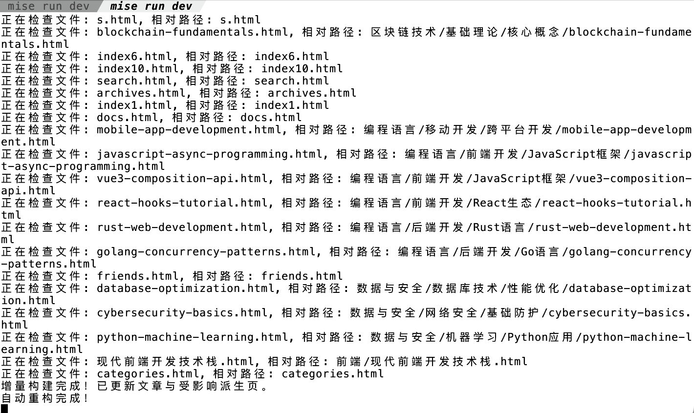

---
sync:
  wechat:
    url: x0aalz08UF8qMGuh3R5oiFTJZeUI7Ew7KKjuSgR-zwhjoGeVRKFQYgyUSv0TDduP
    status: draft
    time: 2026-07-01T16:32:26+08:00
  mowen:
    url: https://note.mowen.cn/detail/y10MzbiBWieHpLE62D7K0
    status: public
    time: 2026-07-01T16:33:42+08:00
---
# 我并不完全相信 AI

RustPress 是我的第一个 Rust 程序，它是一个静态编译型博客，支持增量编译，首页是比较少见的倒分页，它的实现我一直还算满意。它也是我最后一个“纯手写”的程序，之后 2026 就被叫成 AI 编程元年了，我很少再一行行纯手工敲过代码。

今天我挖出这个老博客程序重构。开发时我用 `mise run dev`启动热编译，每次改一个小地方，整个程序都要重新生成一遍，这个过程虽然是增量的，虽然它并不慢，但我仍然等得心里冒火。我让 AI 在开发模式下，把文件写到内存里去，读取也从内存读取，开发阶段别总跟硬盘较劲。

AI 却磨叽起来：“主人，这样很麻烦，实现了恐怕也有不好的影响，特别当博客中有视频、PDF 等大文件时。” 

我心里呵呵：能有什么不好的影响？我自己的博客，没有视频，也没有 PDF，内容主要就是 md 文件。不就是建一个大内存对象，拿页面 URL 当 key 往里面塞资源对象嘛。

我坚持让它做，顺便自己查了下，Rust 有 vfs，这不现成的吗？就用它！

结果 agy 一遍就实现了。强行实现之后，开发模式编译速度一下子感觉快了好几个数量级（如下图所示）。一个字爽！虽然我这台 mac 机器不是机械硬盘，读写硬盘已经很快，但再快也快不过内存读写，这个优化是正确且值得的。

今天 AI 明显想搪塞我，我坚持己见，最终结果才这么好。

这件小事让我更坚定一件事情：AI 再强，决定项目怎么走的，还是我们人类自己。对计算机系统原理、对编程语言运行机制，我们心里总要知道是怎么回事，在项目核心决策这件事上，绝对不能让 AI 越俎代庖。项目中很多节点，很多地方，方向本来就可左可右，AI 有时还会顺着人的脾气，故意给一些它以为会让我们高兴的建议，所以，我们不能完全听它的，我们必须有自己的判断。

AI 的职责，就是干脏活、累活的，我们人类像老板，它像一个 7x24 打工仔，我们不想做的事，都由它来做。核心决策的事，是老板该做的事，一定得是我们人类自己做。这就涉及到一个问题，我们得知道怎么选择，怎么判断。决策结果必须是我们人类自己的思索，不是 AI 告诉我们“你得这样”。所以，我们对计算机原理，对编程语言内在运行机制，我们还是要知悉并完全了解的。

说白了，在 AI 时代，我们仍然需要学习，学习计算机原理，学习编程语言。以前要学习的，现在仍然需要学习，只不过很多接口、语法等知识性内容，我们不需要死记硬背了。但说实话，以前我们也没有死记硬背，不是有谷歌吗，有哪个老程序员没有用过谷歌呢？

2026年07月01日
