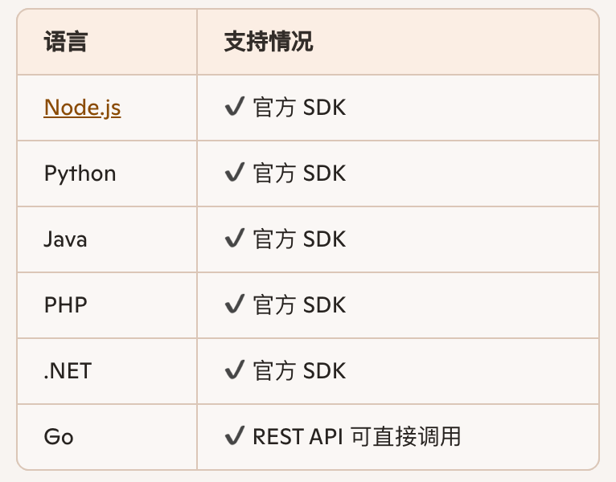
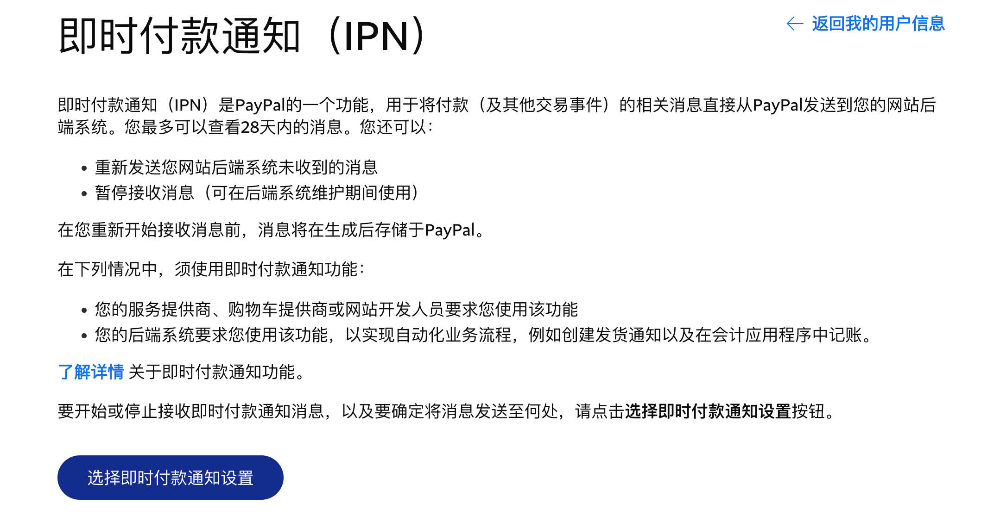

# Paypal 如何收款

上一篇笔记提到 Paypal.cn 支持个人在海外收款了。那么如何收款呢？

我查了一下，典型流程是这样的：

1，客户端发起支付请求

2，服务器端调用 Paypal API 创建订单

3，返回 Approval URL 给前端让用户支付

4，用户完成支付

5，服务器端调用 Paypal API 验证支付，并执行 Capture

6，支付订单完成

这是一个典型的 B/S 架构软件的支付流程。为了配合开发者完成这个流程，Paypal 提供了尽可能多的 SDK。

除了以上这些写好的 SDK，还有 REST API，可以用任何语言自由调用。

为了方便开发者收款，Paypal 还提供了收款码、收款按钮，开发者可以直接使用。对于直接的收款，服务器端还没有创建支付订单呢，如何获取状态呢？别担心，有 IPN。

IPN 是 Instant Payment Notification 的缩写，它的设置链接在这里：

[https://www.paypal.com/merchantnotification/ipn/preference](https://www.paypal.com/merchantnotification/ipn/preference)

我们可以填写一个网站，指向我们的服务器，当有钱进来时，我们能得到程序化的通知。

关于税收，Paypal.cn 是如何规定的呢？对于中国用户，Paypal 并不负责向中国政府报税，用户对于经营性收入，需要自己报税并交纳个人所得税。什么叫经营性收入，就是经常性的营业收入。对于偶然的偶得的赠与，是不属于经营性收入。在 Paypal 网站上还有 Donate SDK，相信就是处理这种非经营性收入的。

#技术·求真·AI

📅 2026/01/18 周日 00:03