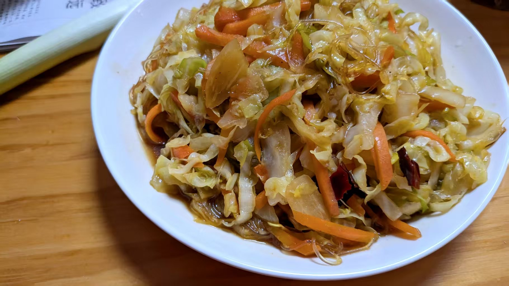

---
title:"人间美味——胡萝卜炒包菜粉丝"
createTime: 2026/01/18 13:48:02
tags: ["胡萝卜炒包菜粉丝做法", "素菜家常菜", "减肥食谱", "包菜粉丝炒菜", "简单快手菜"]
description:"学习胡萝卜炒包菜粉丝的简单做法，这道素菜美味可口，颜色鲜艳，适合减肥和家常烹饪。包菜的甜味与粉丝完美结合，是人间素菜第一美味，快来尝试吧！"
---
# 人间美味——胡萝卜炒包菜粉丝

做法极其简单，包菜切丝，胡萝卜切丝，葱切丝，白粉丝泡上。起锅烧油，炒素菜，加一点大油，下葱丝，下两辣椒段，下包菜丝。包菜稍软，下胡萝卜丝、粉丝。翻炒一会，加盐、酱油、味精调味，出锅装盘。

包菜是甜口的，胡萝卜也是，包菜出点水，正好被粉丝吸收。有红有绿，颜色也好看。好吃极了！真乃人间素菜第一美味也！

#生活·随笔·减肥

📅 2026/01/18 周日 13:47