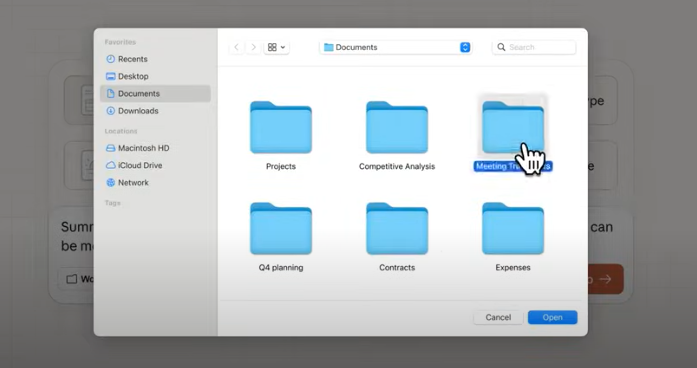

# 继 Claude Code 之后，Anthropic 又推出了 Cowork，为非程序员服务

这个软件功能在 macOS 版本的 Claude 软件中提供，大概 1 月 13 日发布，已经有 4000 多万人使用或知道这个消息了。

它的主要作用，是将 Claude Code 的能力由编程领域扩展到了非编程领域，Anthropic 公司想让非程序员也能享受程序员的高效和快乐。（换句话说，Anthropic 也想让非 IT 领域也经历裁员大风暴。效率提升之后，自然不需要那么多员工了，裁员也成了必然了。）

它是怎么工作的呢？

其实很简单。在原来的 Claude Web 及 Claude Code 中，早已经有对文档、PPT 等文件处理的能力，现在通过 Cowork，只要我们允许 Cowork 访问我们电脑上的某个目录，然后它就能协助我们进行：文件的创建、阅读、修改、保存，甚至包括删除在内的所有操作。像原来琐碎的整理文件夹，整理报销票据，不理账务记录等，都可以交给 Cowork，让它帮助我们生成文档或 Excel。基于一些图片和一些只言片语的灵感，生成一篇文章或生成一个演讲稿，也都不在话下。

除了上面提到的 IO 能力，Cowork 还与浏览器插件版本的 Claude 联手，具有打开网页搜索世界的能力，它还可以与 Claude Code 联手写代码编写软件的能力，甚至在终端中安装、运行软件的能力。后面这两项能力在官方博客中并没有提到，但它绝对做得到，目前是 Anthropic 公司愿不愿意做的问题。

让 AI 操纵我们电脑里的文件，最大的问题就是安全。如果 AI 抽疯或被人控制，突然执行了一行 sudo rm -rf *怎么办？所以，在使用 Cowork 时，我们给它添加的第一条规则应该就是：不允许直接删除任何一个文件，删除之前都需要我的确认。

当然只限制删除也不行，有一种破坏叫“响应不及时”破坏，也应该同时限制 Cowork：不要创建任何大文件，在存储我的电脑不能存储的文件时，一定要经由我同意。

最后这两条都是我臆想的，对于大多数普通工作者，让 AI 帮助我们处理一些发票、账务、文字等繁琐的工作，一定是非常受欢迎的。诸君所虑者，无非就是安全、安全、安全。大不了在交给 Cowork 之前，我自己留一个备份就可以了；还有，严格限制 Cowork 只在某一个文件夹下活动，这样不就安全了？

目前这项功能只提供给 Max 订阅用户使用，对于 Pro 或免费用户，现在想试用的话需要申请：

[https://forms.gle/mtoJrd8kfYny29jQ9](https://forms.gle/mtoJrd8kfYny29jQ9)

我已经申请了，如果我获得了试用权限，到时候体验了再写试用报告。bye。

📅 2026/01/18 周日 22:32